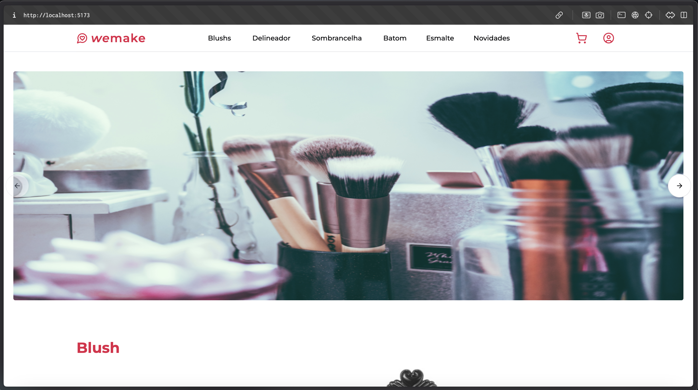
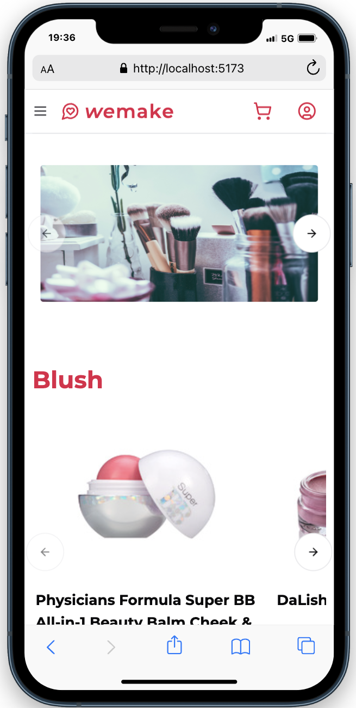

Teste Técnico para Desenvolvedor Frontend Konatus

## Como rodar

Primeiro instale as dependencias do projeto:

```bash
npm install
# ou
yarn
# ou
pnpm i
# ou
bun i
```

Segundo, rode o projeto com:

```bash
npm run dev
# ou
yarn dev
# ou
pnpm dev
# ou
bun dev
```

Abra [http://localhost:5173](http://localhost:5173) com seu browser para ver o resultado

## Desktop



## Mobile



---

<a href="https://www.linkedin.com/in/jovimoura10/" target="_blank" align="left" style="font-style: italic;">
  Desenvolvido por John
</a>

<br>

<a href="https://jovimoura.vercel.app/" target="_blank" align="left" style="font-style: italic;">
  Portfolio
</a>